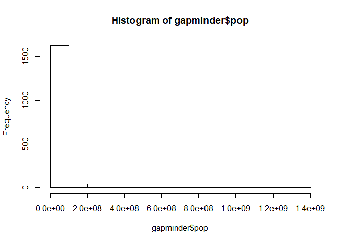
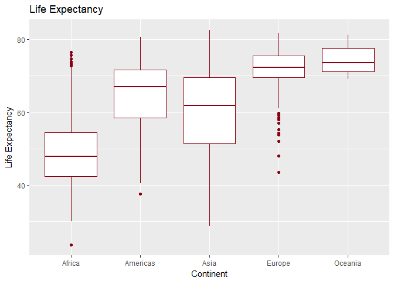

gapminder3
================
Wynes
September 25, 2017

``` r
library(gapminder)
library(tidyverse)
```

    ## Loading tidyverse: ggplot2
    ## Loading tidyverse: tibble
    ## Loading tidyverse: tidyr
    ## Loading tidyverse: readr
    ## Loading tidyverse: purrr
    ## Loading tidyverse: dplyr

    ## Conflicts with tidy packages ----------------------------------------------

    ## filter(): dplyr, stats
    ## lag():    dplyr, stats

``` r
library(ggrepel)
```

Explore Gapminder Dataset
=========================

``` r
typeof(gapminder)
```

    ## [1] "list"

``` r
nrow(gapminder)
```

    ## [1] 1704

``` r
ncol(gapminder)
```

    ## [1] 6

``` r
summary(gapminder)
```

    ##         country        continent        year         lifeExp     
    ##  Afghanistan:  12   Africa  :624   Min.   :1952   Min.   :23.60  
    ##  Albania    :  12   Americas:300   1st Qu.:1966   1st Qu.:48.20  
    ##  Algeria    :  12   Asia    :396   Median :1980   Median :60.71  
    ##  Angola     :  12   Europe  :360   Mean   :1980   Mean   :59.47  
    ##  Argentina  :  12   Oceania : 24   3rd Qu.:1993   3rd Qu.:70.85  
    ##  Australia  :  12                  Max.   :2007   Max.   :82.60  
    ##  (Other)    :1632                                                
    ##       pop              gdpPercap       
    ##  Min.   :6.001e+04   Min.   :   241.2  
    ##  1st Qu.:2.794e+06   1st Qu.:  1202.1  
    ##  Median :7.024e+06   Median :  3531.8  
    ##  Mean   :2.960e+07   Mean   :  7215.3  
    ##  3rd Qu.:1.959e+07   3rd Qu.:  9325.5  
    ##  Max.   :1.319e+09   Max.   :113523.1  
    ## 

``` r
head(gapminder)
```

    ## # A tibble: 6 x 6
    ##       country continent  year lifeExp      pop gdpPercap
    ##        <fctr>    <fctr> <int>   <dbl>    <int>     <dbl>
    ## 1 Afghanistan      Asia  1952  28.801  8425333  779.4453
    ## 2 Afghanistan      Asia  1957  30.332  9240934  820.8530
    ## 3 Afghanistan      Asia  1962  31.997 10267083  853.1007
    ## 4 Afghanistan      Asia  1967  34.020 11537966  836.1971
    ## 5 Afghanistan      Asia  1972  36.088 13079460  739.9811
    ## 6 Afghanistan      Asia  1977  38.438 14880372  786.1134

``` r
typeof(gapminder$country)
```

    ## [1] "integer"

``` r
typeof(gapminder$year)
```

    ## [1] "integer"

``` r
typeof(gapminder$continent)
```

    ## [1] "integer"

``` r
typeof(gapminder$lifeExp)
```

    ## [1] "double"

``` r
typeof(gapminder$pop)
```

    ## [1] "integer"

``` r
typeof(gapminder$gdpPercap)
```

    ## [1] "double"

``` r
str(gapminder)
```

    ## Classes 'tbl_df', 'tbl' and 'data.frame':    1704 obs. of  6 variables:
    ##  $ country  : Factor w/ 142 levels "Afghanistan",..: 1 1 1 1 1 1 1 1 1 1 ...
    ##  $ continent: Factor w/ 5 levels "Africa","Americas",..: 3 3 3 3 3 3 3 3 3 3 ...
    ##  $ year     : int  1952 1957 1962 1967 1972 1977 1982 1987 1992 1997 ...
    ##  $ lifeExp  : num  28.8 30.3 32 34 36.1 ...
    ##  $ pop      : int  8425333 9240934 10267083 11537966 13079460 14880372 12881816 13867957 16317921 22227415 ...
    ##  $ gdpPercap: num  779 821 853 836 740 ...

Summary of Exploration
----------------------

From this exploration we learn that gapminder is a list containing 6 variables (sorted in six columns) and 1704 observations (in 1704 rows).

Some of this information could be obtained in multiple ways. For instance, I used to the function ncol to determine the number of columns. But I could also find this by using the summary function, which shows the six columns or by using the head function, which shows the six columns and the first few rows of data for each column.

The six variables come as different types of data: - continent is a factor - country is a factor - year is an integer - lifeExp is a number - gdpPercap is a number - pop is an integer

Explore Individual Variables
============================

``` r
range(gapminder$pop)
```

    ## [1]      60011 1318683096

``` r
hist(gapminder$pop)
```



``` r
median(gapminder$pop)
```

    ## [1] 7023596

``` r
table(gapminder$continent)
```

    ## 
    ##   Africa Americas     Asia   Europe  Oceania 
    ##      624      300      396      360       24

``` r
summary(gapminder)
```

    ##         country        continent        year         lifeExp     
    ##  Afghanistan:  12   Africa  :624   Min.   :1952   Min.   :23.60  
    ##  Albania    :  12   Americas:300   1st Qu.:1966   1st Qu.:48.20  
    ##  Algeria    :  12   Asia    :396   Median :1980   Median :60.71  
    ##  Angola     :  12   Europe  :360   Mean   :1980   Mean   :59.47  
    ##  Argentina  :  12   Oceania : 24   3rd Qu.:1993   3rd Qu.:70.85  
    ##  Australia  :  12                  Max.   :2007   Max.   :82.60  
    ##  (Other)    :1632                                                
    ##       pop              gdpPercap       
    ##  Min.   :6.001e+04   Min.   :   241.2  
    ##  1st Qu.:2.794e+06   1st Qu.:  1202.1  
    ##  Median :7.024e+06   Median :  3531.8  
    ##  Mean   :2.960e+07   Mean   :  7215.3  
    ##  3rd Qu.:1.959e+07   3rd Qu.:  9325.5  
    ##  Max.   :1.319e+09   Max.   :113523.1  
    ## 

``` r
hist(gapminder$gdpPercap)
```


``` r
median(gapminder$gdpPercap)
```

    ## [1] 3531.847

Population
----------

The range of the population variable (pop) is from 60011 to 1318683096 The distribution can be seen in the attached histogram, which shows non-normal, right skewed distribution. Because the data is not normal the median is an appropriate measure of central tendency, and in this case the median population is 7023596.

Continents
----------

There are five continents provided: Africa, Americas, Asia, Europe and Oceania

GDP Per Capita
--------------

The range of the GDP per Capita variable is form 241.2 to 113523.1. The distribution can be seen in the attached histogram, which also shows a right skewed distribution. The median of this variable is 3531.847

Explore plot types
==================

First I see how GDP per Capita has changed over the years, and I label the country names of the outliers. I use the ggrepel package to ensure that the labels do not obscure the points.

``` r
m <-ggplot(gapminder, aes(x=year, y=gdpPercap, label=country))
m + geom_point(alpha=0.3, col="blue") +
  geom_text_repel(data=subset(gapminder, year < 1980  & gdpPercap > 40000)) +
    stat_smooth(method = 'lm')
```


Here I create a basic histogram of population.

``` r
ggplot(gapminder, aes(x=pop)) +
  geom_histogram(fill="#880011") +  
  ggtitle("Histogram of Population") +
  labs(x="Population", y="Count")
```

    ## `stat_bin()` using `bins = 30`. Pick better value with `binwidth`.


Here I calculate mean life expectancy for every country and use dplyr and piping to group by years to see how life expectancy has changed over time in Africa.

``` r
gapminder %>%
  filter(continent=="Africa") %>%
  group_by(year) %>%
  summarize(mean_lifeExp = mean(lifeExp)) %>%
  ggplot(aes(x=year,y=mean_lifeExp,group=1)) + 
    geom_point(size=3, alpha=.8, color="#880011") +
    stat_smooth(method="lm")+
    ggtitle("Mean life expectancy by year in Africa") +
    labs(x="Year",y="Life Expectancy") 
```


Here I use boxplots to visualize how life expectancy varies by continent.I wanted to experiment here with adding labels to my x and y axes and also a title.

``` r
  ggplot(gapminder, aes(x=continent, y=lifeExp)) + 
    geom_boxplot(color="#880011") +
    ggtitle("Life Expectancy") +
    labs(x="Continent",y="Life Expectancy") 
```



Here I practice filtering and selecting with dplyr.

``` r
filter(gapminder, country=="Canada")
```

    ## # A tibble: 12 x 6
    ##    country continent  year lifeExp      pop gdpPercap
    ##     <fctr>    <fctr> <int>   <dbl>    <int>     <dbl>
    ##  1  Canada  Americas  1952  68.750 14785584  11367.16
    ##  2  Canada  Americas  1957  69.960 17010154  12489.95
    ##  3  Canada  Americas  1962  71.300 18985849  13462.49
    ##  4  Canada  Americas  1967  72.130 20819767  16076.59
    ##  5  Canada  Americas  1972  72.880 22284500  18970.57
    ##  6  Canada  Americas  1977  74.210 23796400  22090.88
    ##  7  Canada  Americas  1982  75.760 25201900  22898.79
    ##  8  Canada  Americas  1987  76.860 26549700  26626.52
    ##  9  Canada  Americas  1992  77.950 28523502  26342.88
    ## 10  Canada  Americas  1997  78.610 30305843  28954.93
    ## 11  Canada  Americas  2002  79.770 31902268  33328.97
    ## 12  Canada  Americas  2007  80.653 33390141  36319.24

``` r
filter(gapminder, continent=="Oceania")
```

    ## # A tibble: 24 x 6
    ##      country continent  year lifeExp      pop gdpPercap
    ##       <fctr>    <fctr> <int>   <dbl>    <int>     <dbl>
    ##  1 Australia   Oceania  1952   69.12  8691212  10039.60
    ##  2 Australia   Oceania  1957   70.33  9712569  10949.65
    ##  3 Australia   Oceania  1962   70.93 10794968  12217.23
    ##  4 Australia   Oceania  1967   71.10 11872264  14526.12
    ##  5 Australia   Oceania  1972   71.93 13177000  16788.63
    ##  6 Australia   Oceania  1977   73.49 14074100  18334.20
    ##  7 Australia   Oceania  1982   74.74 15184200  19477.01
    ##  8 Australia   Oceania  1987   76.32 16257249  21888.89
    ##  9 Australia   Oceania  1992   77.56 17481977  23424.77
    ## 10 Australia   Oceania  1997   78.83 18565243  26997.94
    ## # ... with 14 more rows

``` r
filter(gapminder, continent=="Americas" & year == 1957)
```

    ## # A tibble: 25 x 6
    ##               country continent  year lifeExp      pop gdpPercap
    ##                <fctr>    <fctr> <int>   <dbl>    <int>     <dbl>
    ##  1          Argentina  Americas  1957  64.399 19610538  6856.856
    ##  2            Bolivia  Americas  1957  41.890  3211738  2127.686
    ##  3             Brazil  Americas  1957  53.285 65551171  2487.366
    ##  4             Canada  Americas  1957  69.960 17010154 12489.950
    ##  5              Chile  Americas  1957  56.074  7048426  4315.623
    ##  6           Colombia  Americas  1957  55.118 14485993  2323.806
    ##  7         Costa Rica  Americas  1957  60.026  1112300  2990.011
    ##  8               Cuba  Americas  1957  62.325  6640752  6092.174
    ##  9 Dominican Republic  Americas  1957  49.828  2923186  1544.403
    ## 10            Ecuador  Americas  1957  51.356  4058385  3780.547
    ## # ... with 15 more rows

``` r
select(gapminder, continent,year)
```

    ## # A tibble: 1,704 x 2
    ##    continent  year
    ##       <fctr> <int>
    ##  1      Asia  1952
    ##  2      Asia  1957
    ##  3      Asia  1962
    ##  4      Asia  1967
    ##  5      Asia  1972
    ##  6      Asia  1977
    ##  7      Asia  1982
    ##  8      Asia  1987
    ##  9      Asia  1992
    ## 10      Asia  1997
    ## # ... with 1,694 more rows

Here I combine piping and filter from dplyr with ggplot to see how the populations of the largest European countries have changed over time.

``` r
gapminder %>% 
    filter(continent=="Europe" & pop>18000000) %>% 
      ggplot(aes(x=year,y=pop,col=country)) + 
    geom_point(size=3, alpha=.8) +
    ggtitle("Populations of the largest European nations") +
    labs(x="Year",y="Population") 
```


BONUS
=====

For my bonus task I want to use this data to roughly answer the question: which country currently has the best quality of life? To find that I will create a rough indicator based on life expectancy and GDP per capita and then see which country is at the top of that list.

``` r
gapminder %>%
  mutate(quality=lifeExp*gdpPercap) %>%
  arrange(desc(quality)) %>%
  filter(year=="2007") 
```

    ## # A tibble: 142 x 7
    ##             country continent  year lifeExp       pop gdpPercap quality
    ##              <fctr>    <fctr> <int>   <dbl>     <int>     <dbl>   <dbl>
    ##  1           Norway    Europe  2007  80.196   4627926  49357.19 3958249
    ##  2        Singapore      Asia  2007  79.972   4553009  47143.18 3770134
    ##  3           Kuwait      Asia  2007  77.588   2505559  47306.99 3670455
    ##  4    United States  Americas  2007  78.242 301139947  42951.65 3360623
    ##  5 Hong Kong, China      Asia  2007  82.208   6980412  39724.98 3265711
    ##  6          Ireland    Europe  2007  78.885   4109086  40676.00 3208726
    ##  7      Switzerland    Europe  2007  81.701   7554661  37506.42 3064312
    ##  8          Iceland    Europe  2007  81.757    301931  36180.79 2958033
    ##  9      Netherlands    Europe  2007  79.762  16570613  36797.93 2935077
    ## 10           Canada  Americas  2007  80.653  33390141  36319.24 2929255
    ## # ... with 132 more rows

Obviously quality of living is based on more than just GDP per capita and life expectancy, but given the data available this was the best metric to answer the question. By examining the data we can see if the results pass the smell test: Norway is at the top of the list, which we might expect, and the Democratic Republic of the Congo is at the bottom. This seems reasonable so I trust that the code correctly produced the answer I was looking for.
