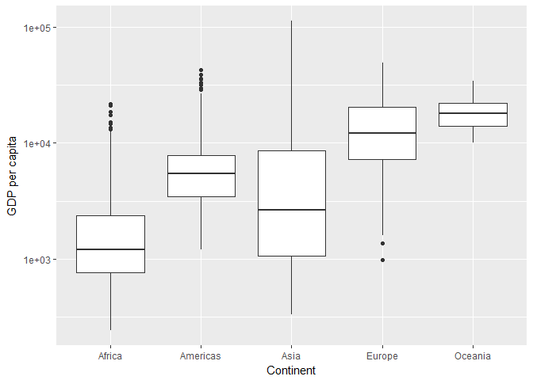
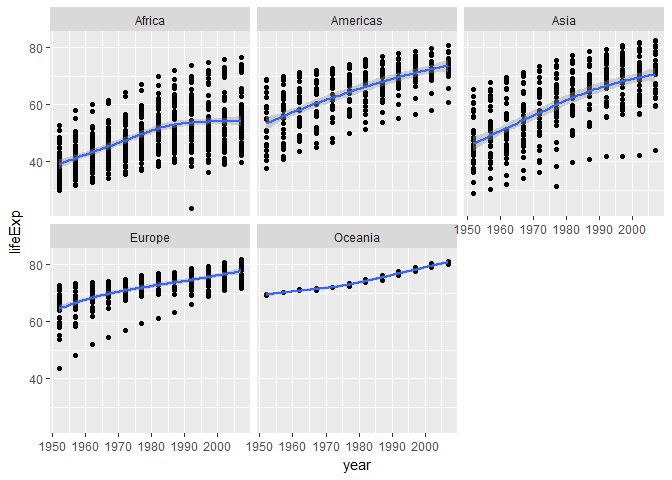
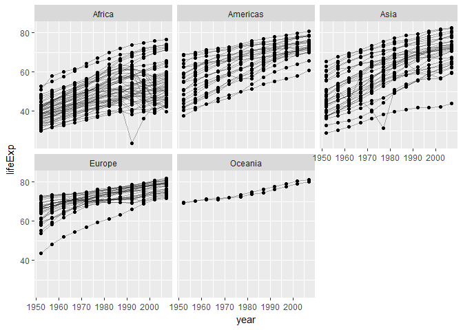
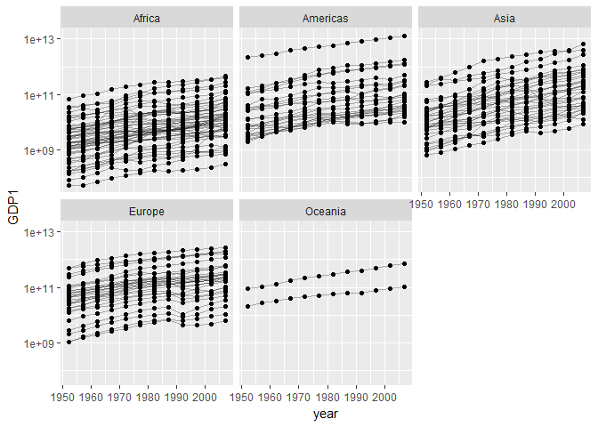
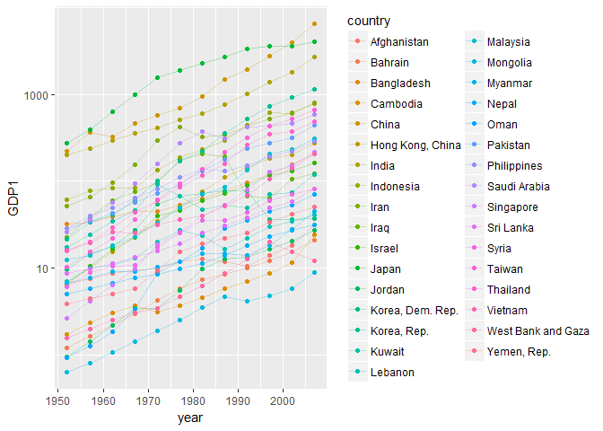
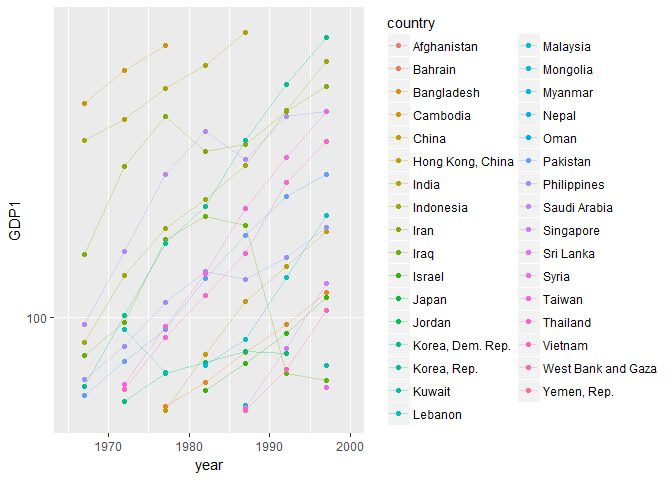
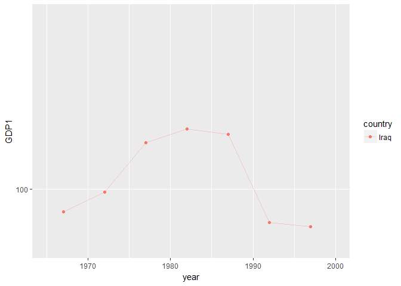

hw03\_ggplot
================
Wynes
September 30, 2017

``` r
library(gapminder)
library(tidyverse)
```

    ## Loading tidyverse: ggplot2
    ## Loading tidyverse: tibble
    ## Loading tidyverse: tidyr
    ## Loading tidyverse: readr
    ## Loading tidyverse: purrr
    ## Loading tidyverse: dplyr

    ## Conflicts with tidy packages ----------------------------------------------

    ## filter(): dplyr, stats
    ## lag():    dplyr, stats

``` r
library(ggrepel)
library(kableExtra)
```

    ## Warning: package 'kableExtra' was built under R version 3.4.2

TASK 1: Find the maximum and minimum GDP per capita of each continent
=====================================================================

``` r
head(gapminder)
```

    ## # A tibble: 6 x 6
    ##       country continent  year lifeExp      pop gdpPercap
    ##        <fctr>    <fctr> <int>   <dbl>    <int>     <dbl>
    ## 1 Afghanistan      Asia  1952  28.801  8425333  779.4453
    ## 2 Afghanistan      Asia  1957  30.332  9240934  820.8530
    ## 3 Afghanistan      Asia  1962  31.997 10267083  853.1007
    ## 4 Afghanistan      Asia  1967  34.020 11537966  836.1971
    ## 5 Afghanistan      Asia  1972  36.088 13079460  739.9811
    ## 6 Afghanistan      Asia  1977  38.438 14880372  786.1134

``` r
gapminder %>%
  group_by(continent) %>% 
  summarize(max_gdpP = max(gdpPercap)) %>% 
  knitr::kable(format = "markdown", padding=2, caption="Maximum GDP per capita by continent")
```

| continent |  max\_gdpP|
|:----------|----------:|
| Africa    |   21951.21|
| Americas  |   42951.65|
| Asia      |  113523.13|
| Europe    |   49357.19|
| Oceania   |   34435.37|

``` r
gapminder %>%
  group_by(continent) %>% 
  summarize(min_gdpP = min(gdpPercap)) %>% 
  knitr::kable()
```

| continent |   min\_gdpP|
|:----------|-----------:|
| Africa    |    241.1659|
| Americas  |   1201.6372|
| Asia      |    331.0000|
| Europe    |    973.5332|
| Oceania   |  10039.5956|

``` r
gapminder %>%
  group_by(continent) %>% 
  ggplot(aes(x=continent,y=gdpPercap)) + 
  geom_boxplot() +
      scale_y_log10() +
  labs(x="Continent", y= "GDP per capita")
```

 Here we see the maximum and minimum for each continent in graphical and tabular form. In the boxplot, we also get some insight into another question, which was the spread of GDP per capita values for each continent.

Task 2: How is life expectancy changing over time on different continents
=========================================================================

``` r
gapminder %>%
  group_by(continent, year) %>% 
  summarize(mean_lifeExp = mean(lifeExp)) %>% 
  knitr::kable()
```

| continent |  year|  mean\_lifeExp|
|:----------|-----:|--------------:|
| Africa    |  1952|       39.13550|
| Africa    |  1957|       41.26635|
| Africa    |  1962|       43.31944|
| Africa    |  1967|       45.33454|
| Africa    |  1972|       47.45094|
| Africa    |  1977|       49.58042|
| Africa    |  1982|       51.59287|
| Africa    |  1987|       53.34479|
| Africa    |  1992|       53.62958|
| Africa    |  1997|       53.59827|
| Africa    |  2002|       53.32523|
| Africa    |  2007|       54.80604|
| Americas  |  1952|       53.27984|
| Americas  |  1957|       55.96028|
| Americas  |  1962|       58.39876|
| Americas  |  1967|       60.41092|
| Americas  |  1972|       62.39492|
| Americas  |  1977|       64.39156|
| Americas  |  1982|       66.22884|
| Americas  |  1987|       68.09072|
| Americas  |  1992|       69.56836|
| Americas  |  1997|       71.15048|
| Americas  |  2002|       72.42204|
| Americas  |  2007|       73.60812|
| Asia      |  1952|       46.31439|
| Asia      |  1957|       49.31854|
| Asia      |  1962|       51.56322|
| Asia      |  1967|       54.66364|
| Asia      |  1972|       57.31927|
| Asia      |  1977|       59.61056|
| Asia      |  1982|       62.61794|
| Asia      |  1987|       64.85118|
| Asia      |  1992|       66.53721|
| Asia      |  1997|       68.02052|
| Asia      |  2002|       69.23388|
| Asia      |  2007|       70.72848|
| Europe    |  1952|       64.40850|
| Europe    |  1957|       66.70307|
| Europe    |  1962|       68.53923|
| Europe    |  1967|       69.73760|
| Europe    |  1972|       70.77503|
| Europe    |  1977|       71.93777|
| Europe    |  1982|       72.80640|
| Europe    |  1987|       73.64217|
| Europe    |  1992|       74.44010|
| Europe    |  1997|       75.50517|
| Europe    |  2002|       76.70060|
| Europe    |  2007|       77.64860|
| Oceania   |  1952|       69.25500|
| Oceania   |  1957|       70.29500|
| Oceania   |  1962|       71.08500|
| Oceania   |  1967|       71.31000|
| Oceania   |  1972|       71.91000|
| Oceania   |  1977|       72.85500|
| Oceania   |  1982|       74.29000|
| Oceania   |  1987|       75.32000|
| Oceania   |  1992|       76.94500|
| Oceania   |  1997|       78.19000|
| Oceania   |  2002|       79.74000|
| Oceania   |  2007|       80.71950|

Here we see one way to get at this information, although ideally we would have separate columns for each continent, I was not able to figure out how to do that.

Graphically it may be easier to see these patterns on a scatterplot.

``` r
gapminder %>% 
  ggplot(aes(x=year, y=lifeExp)) +
  geom_point()+
  geom_smooth() +
facet_wrap(~continent)
```

    ## `geom_smooth()` using method = 'loess'

 From the scatterplot we can conclude that the general trend for life expectancy in the various continents is that it increases over time.To see if individual countries are following this trend I also present a spaghetti plot below:

``` r
gapminder %>% 
  ggplot(aes(x=year,y=lifeExp, group=country))+
  geom_line(alpha=0.3) +
  geom_point()+
  facet_wrap(~continent)
```



Task 3: Find a country with an interesting story
================================================

I'm going to be looking for signs of economic boom or bust on a national level. For this I think GDP is a better indicator than GDP per capita, so I mutate a new column to inspect it.

``` r
gapminder %>% 
  mutate(GDP1=gdpPercap*pop) %>% 
  ggplot(aes(x=year,y=GDP1, group=country))+
  geom_line(alpha=0.3) +
  geom_point()+
    scale_y_log10() +
  facet_wrap(~continent)
```



From this, Asia and Africa seem like they have the most interesting graphs. I will select Asia for further analysis.

``` r
gapminder %>% 
  mutate(GDP1=gdpPercap*pop/1000000000) %>% 
  #Here I change GDP into billions to make it more intuitive
  filter(continent=="Asia") %>%
  ggplot(aes(x=year,y=GDP1, group=country, colour = country))+
  geom_line(alpha=0.3) +
  geom_point()+
    scale_y_log10()
```

 This graph still hasn't cleared things up because it's too hard to read. It does, interestingly show that the Middle East is included in Asia in this dataset, which hadn't really occurred to me up until now. I will restrict the y-axis and x-axis to zoom in on the parts of the graph where there seems to be the most movement.

``` r
gapminder %>% 
  mutate(GDP1=gdpPercap*pop/1000000000) %>% 
  filter(continent=="Asia") %>%
  ggplot(aes(x=year,y=GDP1, group=country, colour = country))+
  geom_line(alpha=0.3) +
  geom_point()+
    scale_y_log10(limits=c(50,800)) +
  scale_x_continuous(limits=c(1965,2000))
```

    ## Warning: Removed 135 rows containing missing values (geom_path).

    ## Warning: Removed 293 rows containing missing values (geom_point).

 This graph really shows the one country whose GDP dropped drastically in the late 80s and into the early 90s, but even with the colour differentiation it's hard to tell them apart.

``` r
gapminder %>% 
  mutate(GDP1=gdpPercap*pop/1000000000) %>% 
  filter(country=="Iraq") %>%
  ggplot(aes(x=year,y=GDP1, group=country, colour = country))+
  geom_line(alpha=0.3) +
  geom_point()+
    scale_y_log10(limits=c(50,800)) +
  scale_x_continuous(limits=c(1965,2000))
```

    ## Warning: Removed 5 rows containing missing values (geom_path).

    ## Warning: Removed 5 rows containing missing values (geom_point).

 I guessed that the green colour was Iraq, filtered by country, and found this. I am guessing that the plunge in GDP was caused by the Gulf War, which happened in 1990. Kuwait was also annexed by Iraq prior to the war, so I'll isolate Kuwait over the same time period:

So I find it much easier to code with ggplot than dplyr, but this was a rambling, imprecise way to go about finding this interesting tidbit. I'll try now to find what country experienced the greatest drop in GDP by looking at tables.

``` r
gapminder %>%
  mutate(GDP1=gdpPercap*pop/1000000000) %>% 
  select(country, year, continent, GDP1) %>%
  group_by(continent, country) %>%
  ## within countries take the GDP and subtract the GDP from the previous year
  mutate(econ = GDP1 - lag(GDP1)) %>% 
  summarize(bust = min(econ, na.rm = TRUE)) %>% 
  arrange(bust) %>% 
    knitr::kable()
```

| continent    | country                     |                                                                                                                                                                                                                                                                                                                                                                                                                                                                                                                                                                                                                                                                           bust|
|:-------------|:----------------------------|------------------------------------------------------------------------------------------------------------------------------------------------------------------------------------------------------------------------------------------------------------------------------------------------------------------------------------------------------------------------------------------------------------------------------------------------------------------------------------------------------------------------------------------------------------------------------------------------------------------------------------------------------------------------------:|
| Asia         | Iraq                        |                                                                                                                                                                                                                                                                                                                                                                                                                                                                                                                                                                                                                                                                   -125.7175454|
| Asia         | Iran                        |                                                                                                                                                                                                                                                                                                                                                                                                                                                                                                                                                                                                                                                                    -94.1035240|
| Europe       | Romania                     |                                                                                                                                                                                                                                                                                                                                                                                                                                                                                                                                                                                                                                                                    -69.5491246|
| Asia         | Saudi Arabia                |                                                                                                                                                                                                                                                                                                                                                                                                                                                                                                                                                                                                                                                                    -69.2924606|
| Americas     | Argentina                   |                                                                                                                                                                                                                                                                                                                                                                                                                                                                                                                                                                                                                                                                    -59.8301555|
| Europe       | Serbia                      |                                                                                                                                                                                                                                                                                                                                                                                                                                                                                                                                                                                                                                                                    -54.8688130|
| Europe       | Poland                      |                                                                                                                                                                                                                                                                                                                                                                                                                                                                                                                                                                                                                                                                    -45.8281143|
| Asia         | China                       |                                                                                                                                                                                                                                                                                                                                                                                                                                                                                                                                                                                                                                                                    -42.4599911|
| Asia         | Korea, Dem. Rep.            |                                                                                                                                                                                                                                                                                                                                                                                                                                                                                                                                                                                                                                                                    -40.6767352|
| Americas     | Brazil                      |                                                                                                                                                                                                                                                                                                                                                                                                                                                                                                                                                                                                                                                                    -31.8540916|
| Europe       | Hungary                     |                                                                                                                                                                                                                                                                                                                                                                                                                                                                                                                                                                                                                                                                    -28.7922449|
| Americas     | Peru                        |                                                                                                                                                                                                                                                                                                                                                                                                                                                                                                                                                                                                                                                                    -28.7308098|
| Asia         | Kuwait                      |                                                                                                                                                                                                                                                                                                                                                                                                                                                                                                                                                                                                                                                                    -24.4798853|
| Europe       | Croatia                     |                                                                                                                                                                                                                                                                                                                                                                                                                                                                                                                                                                                                                                                                    -24.0202514|
| Europe       | Czech Republic              |                                                                                                                                                                                                                                                                                                                                                                                                                                                                                                                                                                                                                                                                    -20.7029088|
| Europe       | Bulgaria                    |                                                                                                                                                                                                                                                                                                                                                                                                                                                                                                                                                                                                                                                                    -19.3563286|
| Americas     | Venezuela                   |                                                                                                                                                                                                                                                                                                                                                                                                                                                                                                                                                                                                                                                                    -18.4502730|
| Americas     | Cuba                        |                                                                                                                                                                                                                                                                                                                                                                                                                                                                                                                                                                                                                                                                    -17.1624168|
| Asia         | Indonesia                   |                                                                                                                                                                                                                                                                                                                                                                                                                                                                                                                                                                                                                                                                    -15.0469100|
| Americas     | Ecuador                     |                                                                                                                                                                                                                                                                                                                                                                                                                                                                                                                                                                                                                                                                    -13.9034746|
| Africa       | Angola                      |                                                                                                                                                                                                                                                                                                                                                                                                                                                                                                                                                                                                                                                                    -13.7229397|
| Africa       | Libya                       |                                                                                                                                                                                                                                                                                                                                                                                                                                                                                                                                                                                                                                                                    -13.3410050|
| Europe       | Slovak Republic             |                                                                                                                                                                                                                                                                                                                                                                                                                                                                                                                                                                                                                                                                    -12.2162715|
| Africa       | Nigeria                     |                                                                                                                                                                                                                                                                                                                                                                                                                                                                                                                                                                                                                                                                     -8.1144041|
| Europe       | Slovenia                    |                                                                                                                                                                                                                                                                                                                                                                                                                                                                                                                                                                                                                                                                     -7.9277968|
| Europe       | Bosnia and Herzegovina      |                                                                                                                                                                                                                                                                                                                                                                                                                                                                                                                                                                                                                                                                     -7.8797098|
| Asia         | Philippines                 |                                                                                                                                                                                                                                                                                                                                                                                                                                                                                                                                                                                                                                                                     -7.7455684|
| Asia         | Lebanon                     |                                                                                                                                                                                                                                                                                                                                                                                                                                                                                                                                                                                                                                                                     -6.9736031|
| Africa       | Cameroon                    |                                                                                                                                                                                                                                                                                                                                                                                                                                                                                                                                                                                                                                                                     -5.7027829|
| Africa       | Congo, Dem. Rep.            |                                                                                                                                                                                                                                                                                                                                                                                                                                                                                                                                                                                                                                                                     -4.7970179|
| Asia         | West Bank and Gaza          |                                                                                                                                                                                                                                                                                                                                                                                                                                                                                                                                                                                                                                                                     -4.7894764|
| Americas     | Uruguay                     |                                                                                                                                                                                                                                                                                                                                                                                                                                                                                                                                                                                                                                                                     -4.1302156|
| Africa       | Gabon                       |                                                                                                                                                                                                                                                                                                                                                                                                                                                                                                                                                                                                                                                                     -3.9667847|
| Americas     | Nicaragua                   |                                                                                                                                                                                                                                                                                                                                                                                                                                                                                                                                                                                                                                                                     -3.6758673|
| Americas     | El Salvador                 |                                                                                                                                                                                                                                                                                                                                                                                                                                                                                                                                                                                                                                                                     -3.6683073|
| Europe       | Switzerland                 |                                                                                                                                                                                                                                                                                                                                                                                                                                                                                                                                                                                                                                                                     -3.6552092|
| Europe       | Albania                     |                                                                                                                                                                                                                                                                                                                                                                                                                                                                                                                                                                                                                                                                     -3.1906962|
| Americas     | Chile                       |                                                                                                                                                                                                                                                                                                                                                                                                                                                                                                                                                                                                                                                                     -2.9676023|
| Africa       | Algeria                     |                                                                                                                                                                                                                                                                                                                                                                                                                                                                                                                                                                                                                                                                     -2.8947099|
| Africa       | Ethiopia                    |                                                                                                                                                                                                                                                                                                                                                                                                                                                                                                                                                                                                                                                                     -2.7229120|
| Europe       | Montenegro                  |                                                                                                                                                                                                                                                                                                                                                                                                                                                                                                                                                                                                                                                                     -2.3279251|
| Africa       | Zimbabwe                    |                                                                                                                                                                                                                                                                                                                                                                                                                                                                                                                                                                                                                                                                     -2.2324526|
| Africa       | Cote d'Ivoire               |                                                                                                                                                                                                                                                                                                                                                                                                                                                                                                                                                                                                                                                                     -2.1610349|
| Africa       | Sierra Leone                |                                                                                                                                                                                                                                                                                                                                                                                                                                                                                                                                                                                                                                                                     -1.9227298|
| Africa       | Somalia                     |                                                                                                                                                                                                                                                                                                                                                                                                                                                                                                                                                                                                                                                                     -1.9130149|
| Africa       | Mozambique                  |                                                                                                                                                                                                                                                                                                                                                                                                                                                                                                                                                                                                                                                                     -1.5214031|
| Americas     | Trinidad and Tobago         |                                                                                                                                                                                                                                                                                                                                                                                                                                                                                                                                                                                                                                                                     -1.3794596|
| Africa       | Sudan                       |                                                                                                                                                                                                                                                                                                                                                                                                                                                                                                                                                                                                                                                                     -1.3243704|
| Americas     | Haiti                       |                                                                                                                                                                                                                                                                                                                                                                                                                                                                                                                                                                                                                                                                     -1.2800429|
| Asia         | Afghanistan                 |                                                                                                                                                                                                                                                                                                                                                                                                                                                                                                                                                                                                                                                                     -1.2250887|
| Africa       | Rwanda                      |                                                                                                                                                                                                                                                                                                                                                                                                                                                                                                                                                                                                                                                                     -1.1183560|
| Africa       | Chad                        |                                                                                                                                                                                                                                                                                                                                                                                                                                                                                                                                                                                                                                                                     -1.0863247|
| Africa       | Niger                       |                                                                                                                                                                                                                                                                                                                                                                                                                                                                                                                                                                                                                                                                     -0.9556503|
| Asia         | Vietnam                     |                                                                                                                                                                                                                                                                                                                                                                                                                                                                                                                                                                                                                                                                     -0.9489054|
| Americas     | Bolivia                     |                                                                                                                                                                                                                                                                                                                                                                                                                                                                                                                                                                                                                                                                     -0.8860042|
| Africa       | Uganda                      |                                                                                                                                                                                                                                                                                                                                                                                                                                                                                                                                                                                                                                                                     -0.8391745|
| Africa       | Burundi                     |                                                                                                                                                                                                                                                                                                                                                                                                                                                                                                                                                                                                                                                                     -0.8346834|
| Asia         | Bangladesh                  |                                                                                                                                                                                                                                                                                                                                                                                                                                                                                                                                                                                                                                                                     -0.7113816|
| Asia         | Mongolia                    |                                                                                                                                                                                                                                                                                                                                                                                                                                                                                                                                                                                                                                                                     -0.5821163|
| Asia         | Myanmar                     |                                                                                                                                                                                                                                                                                                                                                                                                                                                                                                                                                                                                                                                                     -0.5713538|
| Africa       | Ghana                       |                                                                                                                                                                                                                                                                                                                                                                                                                                                                                                                                                                                                                                                                     -0.5545595|
| Americas     | Jamaica                     |                                                                                                                                                                                                                                                                                                                                                                                                                                                                                                                                                                                                                                                                     -0.5068213|
| Asia         | Cambodia                    |                                                                                                                                                                                                                                                                                                                                                                                                                                                                                                                                                                                                                                                                     -0.5017695|
| Africa       | Madagascar                  |                                                                                                                                                                                                                                                                                                                                                                                                                                                                                                                                                                                                                                                                     -0.4155730|
| Asia         | Syria                       |                                                                                                                                                                                                                                                                                                                                                                                                                                                                                                                                                                                                                                                                     -0.3593348|
| Africa       | Eritrea                     |                                                                                                                                                                                                                                                                                                                                                                                                                                                                                                                                                                                                                                                                     -0.3282389|
| Africa       | Burkina Faso                |                                                                                                                                                                                                                                                                                                                                                                                                                                                                                                                                                                                                                                                                     -0.2663049|
| Africa       | Reunion                     |                                                                                                                                                                                                                                                                                                                                                                                                                                                                                                                                                                                                                                                                     -0.2044118|
| Africa       | Guinea-Bissau               |                                                                                                                                                                                                                                                                                                                                                                                                                                                                                                                                                                                                                                                                     -0.1838818|
| Europe       | Finland                     |                                                                                                                                                                                                                                                                                                                                                                                                                                                                                                                                                                                                                                                                     -0.1785792|
| Africa       | Liberia                     |                                                                                                                                                                                                                                                                                                                                                                                                                                                                                                                                                                                                                                                                     -0.1720250|
| Africa       | Mali                        |                                                                                                                                                                                                                                                                                                                                                                                                                                                                                                                                                                                                                                                                     -0.1308165|
| Africa       | Comoros                     |                                                                                                                                                                                                                                                                                                                                                                                                                                                                                                                                                                                                                                                                     -0.1271089|
| Africa       | Djibouti                    |                                                                                                                                                                                                                                                                                                                                                                                                                                                                                                                                                                                                                                                                     -0.1212561|
| Africa       | Gambia                      |                                                                                                                                                                                                                                                                                                                                                                                                                                                                                                                                                                                                                                                                     -0.0791060|
| Europe       | Iceland                     |                                                                                                                                                                                                                                                                                                                                                                                                                                                                                                                                                                                                                                                                     -0.0747632|
| Africa       | Zambia                      |                                                                                                                                                                                                                                                                                                                                                                                                                                                                                                                                                                                                                                                                     -0.0588373|
| Africa       | Equatorial Guinea           |                                                                                                                                                                                                                                                                                                                                                                                                                                                                                                                                                                                                                                                                     -0.0512668|
| Asia         | Jordan                      |                                                                                                                                                                                                                                                                                                                                                                                                                                                                                                                                                                                                                                                                     -0.0351390|
| Africa       | Central African Republic    |                                                                                                                                                                                                                                                                                                                                                                                                                                                                                                                                                                                                                                                                     -0.0347561|
| Africa       | Sao Tome and Principe       |                                                                                                                                                                                                                                                                                                                                                                                                                                                                                                                                                                                                                                                                     -0.0183131|
| Africa       | Benin                       |                                                                                                                                                                                                                                                                                                                                                                                                                                                                                                                                                                                                                                                                      0.0000000|
| Africa       | Congo, Rep.                 |                                                                                                                                                                                                                                                                                                                                                                                                                                                                                                                                                                                                                                                                      0.0118327|
| Africa       | Togo                        |                                                                                                                                                                                                                                                                                                                                                                                                                                                                                                                                                                                                                                                                      0.0175513|
| Africa       | Lesotho                     |                                                                                                                                                                                                                                                                                                                                                                                                                                                                                                                                                                                                                                                                      0.0495190|
| Africa       | Botswana                    |                                                                                                                                                                                                                                                                                                                                                                                                                                                                                                                                                                                                                                                                      0.0593182|
| Africa       | Mauritania                  |                                                                                                                                                                                                                                                                                                                                                                                                                                                                                                                                                                                                                                                                      0.0664451|
| Africa       | Swaziland                   |                                                                                                                                                                                                                                                                                                                                                                                                                                                                                                                                                                                                                                                                      0.0733890|
| Oceania      | New Zealand                 |                                                                                                                                                                                                                                                                                                                                                                                                                                                                                                                                                                                                                                                                      0.0771160|
| Africa       | Namibia                     |                                                                                                                                                                                                                                                                                                                                                                                                                                                                                                                                                                                                                                                                      0.1152069|
| Africa       | Tunisia                     |                                                                                                                                                                                                                                                                                                                                                                                                                                                                                                                                                                                                                                                                      0.1557428|
| Africa       | Mauritius                   |                                                                                                                                                                                                                                                                                                                                                                                                                                                                                                                                                                                                                                                                      0.1809289|
| Africa       | Malawi                      |                                                                                                                                                                                                                                                                                                                                                                                                                                                                                                                                                                                                                                                                      0.2114591|
| Americas     | Costa Rica                  |                                                                                                                                                                                                                                                                                                                                                                                                                                                                                                                                                                                                                                                                      0.2622352|
| Americas     | Guatemala                   |                                                                                                                                                                                                                                                                                                                                                                                                                                                                                                                                                                                                                                                                      0.2813792|
| Africa       | Guinea                      |                                                                                                                                                                                                                                                                                                                                                                                                                                                                                                                                                                                                                                                                      0.2910100|
| Asia         | Oman                        |                                                                                                                                                                                                                                                                                                                                                                                                                                                                                                                                                                                                                                                                      0.3319363|
| Americas     | Paraguay                    |                                                                                                                                                                                                                                                                                                                                                                                                                                                                                                                                                                                                                                                                      0.3733737|
| Asia         | Bahrain                     |                                                                                                                                                                                                                                                                                                                                                                                                                                                                                                                                                                                                                                                                      0.4249010|
| Asia         | Yemen, Rep.                 |                                                                                                                                                                                                                                                                                                                                                                                                                                                                                                                                                                                                                                                                      0.5447179|
| Americas     | Panama                      |                                                                                                                                                                                                                                                                                                                                                                                                                                                                                                                                                                                                                                                                      0.5937039|
| Americas     | Honduras                    |                                                                                                                                                                                                                                                                                                                                                                                                                                                                                                                                                                                                                                                                      0.6004318|
| Africa       | Tanzania                    |                                                                                                                                                                                                                                                                                                                                                                                                                                                                                                                                                                                                                                                                      0.6385107|
| Africa       | Senegal                     |                                                                                                                                                                                                                                                                                                                                                                                                                                                                                                                                                                                                                                                                      0.7175269|
| Europe       | Ireland                     |                                                                                                                                                                                                                                                                                                                                                                                                                                                                                                                                                                                                                                                                      0.7338176|
| Africa       | Kenya                       |                                                                                                                                                                                                                                                                                                                                                                                                                                                                                                                                                                                                                                                                      0.7437949|
| Asia         | Nepal                       |                                                                                                                                                                                                                                                                                                                                                                                                                                                                                                                                                                                                                                                                      0.7579878|
| Americas     | Dominican Republic          |                                                                                                                                                                                                                                                                                                                                                                                                                                                                                                                                                                                                                                                                      0.9560842|
| Asia         | Sri Lanka                   |                                                                                                                                                                                                                                                                                                                                                                                                                                                                                                                                                                                                                                                                      1.1416678|
| Asia         | Singapore                   |                                                                                                                                                                                                                                                                                                                                                                                                                                                                                                                                                                                                                                                                      1.5017663|
| Asia         | Malaysia                    |                                                                                                                                                                                                                                                                                                                                                                                                                                                                                                                                                                                                                                                                      1.6513569|
| Africa       | Morocco                     |                                                                                                                                                                                                                                                                                                                                                                                                                                                                                                                                                                                                                                                                      1.7220042|
| Americas     | Puerto Rico                 |                                                                                                                                                                                                                                                                                                                                                                                                                                                                                                                                                                                                                                                                      1.9666485|
| Asia         | Hong Kong, China            |                                                                                                                                                                                                                                                                                                                                                                                                                                                                                                                                                                                                                                                                      3.4368479|
| Asia         | Thailand                    |                                                                                                                                                                                                                                                                                                                                                                                                                                                                                                                                                                                                                                                                      3.7396459|
| Asia         | Israel                      |                                                                                                                                                                                                                                                                                                                                                                                                                                                                                                                                                                                                                                                                      3.8472399|
| Africa       | Egypt                       |                                                                                                                                                                                                                                                                                                                                                                                                                                                                                                                                                                                                                                                                      4.9561635|
| Asia         | Taiwan                      |                                                                                                                                                                                                                                                                                                                                                                                                                                                                                                                                                                                                                                                                      5.0063848|
| Asia         | Japan                       |                                                                                                                                                                                                                                                                                                                                                                                                                                                                                                                                                                                                                                                                      5.0303678|
| Americas     | Colombia                    |                                                                                                                                                                                                                                                                                                                                                                                                                                                                                                                                                                                                                                                                      5.6464383|
| Asia         | Pakistan                    |                                                                                                                                                                                                                                                                                                                                                                                                                                                                                                                                                                                                                                                                      6.5680804|
| Asia         | Korea, Rep.                 |                                                                                                                                                                                                                                                                                                                                                                                                                                                                                                                                                                                                                                                                      6.9538917|
| Europe       | Denmark                     |                                                                                                                                                                                                                                                                                                                                                                                                                                                                                                                                                                                                                                                                      7.0749904|
| Europe       | Norway                      |                                                                                                                                                                                                                                                                                                                                                                                                                                                                                                                                                                                                                                                                      7.1001338|
| Europe       | Portugal                    |                                                                                                                                                                                                                                                                                                                                                                                                                                                                                                                                                                                                                                                                      7.1222039|
| Africa       | South Africa                |                                                                                                                                                                                                                                                                                                                                                                                                                                                                                                                                                                                                                                                                      7.5355385|
| Americas     | Mexico                      |                                                                                                                                                                                                                                                                                                                                                                                                                                                                                                                                                                                                                                                                      7.5654115|
| Europe       | Sweden                      |                                                                                                                                                                                                                                                                                                                                                                                                                                                                                                                                                                                                                                                                      9.5716538|
| Europe       | Greece                      |                                                                                                                                                                                                                                                                                                                                                                                                                                                                                                                                                                                                                                                                     11.0311937|
| Europe       | Turkey                      |                                                                                                                                                                                                                                                                                                                                                                                                                                                                                                                                                                                                                                                                     12.2377580|
| Europe       | Netherlands                 |                                                                                                                                                                                                                                                                                                                                                                                                                                                                                                                                                                                                                                                                     12.4259966|
| Europe       | Belgium                     |                                                                                                                                                                                                                                                                                                                                                                                                                                                                                                                                                                                                                                                                     13.9924810|
| Europe       | Austria                     |                                                                                                                                                                                                                                                                                                                                                                                                                                                                                                                                                                                                                                                                     14.1174301|
| Oceania      | Australia                   |                                                                                                                                                                                                                                                                                                                                                                                                                                                                                                                                                                                                                                                                     19.0929731|
| Europe       | Spain                       |                                                                                                                                                                                                                                                                                                                                                                                                                                                                                                                                                                                                                                                                     26.7598780|
| Asia         | India                       |                                                                                                                                                                                                                                                                                                                                                                                                                                                                                                                                                                                                                                                                     38.0128976|
| Europe       | Italy                       |                                                                                                                                                                                                                                                                                                                                                                                                                                                                                                                                                                                                                                                                     41.1564383|
| Americas     | Canada                      |                                                                                                                                                                                                                                                                                                                                                                                                                                                                                                                                                                                                                                                                     43.1407438|
| Europe       | United Kingdom              |                                                                                                                                                                                                                                                                                                                                                                                                                                                                                                                                                                                                                                                                     48.0797409|
| Europe       | France                      |                                                                                                                                                                                                                                                                                                                                                                                                                                                                                                                                                                                                                                                                     85.3743273|
| Europe       | Germany                     |                                                                                                                                                                                                                                                                                                                                                                                                                                                                                                                                                                                                                                                                    122.5401978|
| Americas     | United States               |                                                                                                                                                                                                                                                                                                                                                                                                                                                                                                                                                                                                                                                                    349.2258875|
| The column " | bust" shows the countries w |  ith the greatest decreases in GDP at the top, and the greatest increases at the bottom. Iraq was where we might have expected after the informal survey of results from ggplot. The greatest increase in GDP was the United States, which got me thinking that although the US might have had the greatest absolute increase in GDP, that could be because they have a very large economy. A more telling sign of a boom or a bust is having a large increase or decrease in GDP compared to one's own GDP (e.g. America's economy increasing by 1% is a large absolute value, but is less remarkable than if Ireland's GDP tripled even if that resulted in the same value).|

Below I test instead for greatest relative changes in GDP:

``` r
gapminder %>%
  mutate(GDP1=gdpPercap*pop/1000000000) %>% 
  select(country, year, continent, GDP1) %>%
  group_by(continent, country) %>%
  #Here I mutate a column of largest relative change
  mutate(econ = ((GDP1 - lag(GDP1))/GDP1)) %>% 
  summarize(bust = min(econ, na.rm = TRUE)) %>% 
  arrange(bust) %>% 
    knitr::kable()
```

| continent | country                  |        bust|
|:----------|:-------------------------|-----------:|
| Asia      | Iraq                     |  -1.8790659|
| Asia      | Korea, Dem. Rep.         |  -1.1145788|
| Africa    | Angola                   |  -0.7401276|
| Africa    | Sierra Leone             |  -0.7308367|
| Europe    | Bosnia and Herzegovina   |  -0.7269685|
| Europe    | Croatia                  |  -0.6327030|
| Europe    | Serbia                   |  -0.5987965|
| Europe    | Montenegro               |  -0.5347345|
| Europe    | Romania                  |  -0.4623535|
| Asia      | Kuwait                   |  -0.4394086|
| Asia      | Lebanon                  |  -0.4197998|
| Africa    | Zimbabwe                 |  -0.3860599|
| Europe    | Albania                  |  -0.3840639|
| Africa    | Comoros                  |  -0.3557105|
| Americas  | Nicaragua                |  -0.3555133|
| Europe    | Bulgaria                 |  -0.3546979|
| Africa    | Gabon                    |  -0.3481599|
| Africa    | Somalia                  |  -0.3383309|
| Asia      | West Bank and Gaza       |  -0.3129232|
| Africa    | Libya                    |  -0.2982802|
| Africa    | Burundi                  |  -0.2944199|
| Americas  | Peru                     |  -0.2880735|
| Asia      | Iran                     |  -0.2871532|
| Americas  | Cuba                     |  -0.2861666|
| Africa    | Chad                     |  -0.2792683|
| Europe    | Slovenia                 |  -0.2789690|
| Africa    | Congo, Dem. Rep.         |  -0.2782314|
| Africa    | Equatorial Guinea        |  -0.2746479|
| Africa    | Mozambique               |  -0.2721774|
| Europe    | Hungary                  |  -0.2640766|
| Africa    | Rwanda                   |  -0.2628319|
| Africa    | Cameroon                 |  -0.2550933|
| Europe    | Slovak Republic          |  -0.2425340|
| Africa    | Guinea-Bissau            |  -0.2397094|
| Asia      | Saudi Arabia             |  -0.2235867|
| Americas  | El Salvador              |  -0.2000214|
| Africa    | Niger                    |  -0.1950147|
| Americas  | Ecuador                  |  -0.1863865|
| Americas  | Argentina                |  -0.1774199|
| Asia      | Cambodia                 |  -0.1597303|
| Americas  | Uruguay                  |  -0.1589366|
| Americas  | Trinidad and Tobago      |  -0.1567158|
| Europe    | Poland                   |  -0.1543313|
| Africa    | Djibouti                 |  -0.1531121|
| Africa    | Gambia                   |  -0.1524390|
| Asia      | Mongolia                 |  -0.1409728|
| Europe    | Czech Republic           |  -0.1403741|
| Americas  | Haiti                    |  -0.1389296|
| Asia      | China                    |  -0.1307754|
| Africa    | Liberia                  |  -0.1299368|
| Americas  | Bolivia                  |  -0.1296546|
| Africa    | Ethiopia                 |  -0.1240637|
| Asia      | Afghanistan              |  -0.1156191|
| Africa    | Sao Tome and Principe    |  -0.1089744|
| Africa    | Algeria                  |  -0.1031563|
| Africa    | Cote d'Ivoire            |  -0.1026611|
| Africa    | Eritrea                  |  -0.0971432|
| Africa    | Reunion                  |  -0.0961597|
| Africa    | Uganda                   |  -0.0950570|
| Americas  | Venezuela                |  -0.0882803|
| Africa    | Nigeria                  |  -0.0704490|
| Africa    | Burkina Faso             |  -0.0608247|
| Asia      | Philippines              |  -0.0589388|
| Americas  | Chile                    |  -0.0588568|
| Africa    | Ghana                    |  -0.0529833|
| Asia      | Myanmar                  |  -0.0406090|
| Asia      | Vietnam                  |  -0.0377398|
| Africa    | Sudan                    |  -0.0355228|
| Americas  | Jamaica                  |  -0.0353352|
| Africa    | Madagascar               |  -0.0347780|
| Africa    | Mali                     |  -0.0302465|
| Americas  | Brazil                   |  -0.0293836|
| Asia      | Indonesia                |  -0.0248066|
| Europe    | Switzerland              |  -0.0214468|
| Asia      | Bangladesh               |  -0.0159521|
| Africa    | Central African Republic |  -0.0146659|
| Europe    | Iceland                  |  -0.0114796|
| Asia      | Jordan                   |  -0.0103169|
| Asia      | Syria                    |  -0.0102546|
| Africa    | Zambia                   |  -0.0058314|
| Europe    | Finland                  |  -0.0017157|
| Africa    | Benin                    |   0.0000000|
| Oceania   | New Zealand              |   0.0012216|
| Africa    | Congo, Rep.              |   0.0013645|
| Asia      | Japan                    |   0.0013840|
| Africa    | Togo                     |   0.0049356|
| Americas  | Guatemala                |   0.0090442|
| Americas  | Mexico                   |   0.0108680|
| Americas  | Paraguay                 |   0.0167695|
| Americas  | Costa Rica               |   0.0205533|
| Americas  | Colombia                 |   0.0239243|
| Africa    | Namibia                  |   0.0244017|
| Europe    | Italy                    |   0.0247742|
| Africa    | South Africa             |   0.0260977|
| Africa    | Tunisia                  |   0.0282534|
| Africa    | Mauritania               |   0.0304601|
| Americas  | Panama                   |   0.0360968|
| Europe    | Netherlands              |   0.0405767|
| Americas  | Puerto Rico              |   0.0449856|
| Europe    | Portugal                 |   0.0453866|
| Europe    | Ireland                  |   0.0455352|
| Europe    | Sweden                   |   0.0459719|
| Europe    | United Kingdom           |   0.0468062|
| Africa    | Kenya                    |   0.0484647|
| Africa    | Tanzania                 |   0.0496709|
| Europe    | Turkey                   |   0.0498745|
| Asia      | Thailand                 |   0.0510582|
| Europe    | Denmark                  |   0.0570329|
| Americas  | Canada                   |   0.0591773|
| Europe    | Germany                  |   0.0626276|
| Europe    | France                   |   0.0661427|
| Europe    | Belgium                  |   0.0699319|
| Europe    | Greece                   |   0.0707113|
| Africa    | Mauritius                |   0.0739230|
| Africa    | Malawi                   |   0.0832181|
| Africa    | Morocco                  |   0.0842004|
| Africa    | Guinea                   |   0.0843856|
| Europe    | Austria                  |   0.0862979|
| Americas  | United States            |   0.0869968|
| Africa    | Swaziland                |   0.0876384|
| Europe    | Spain                    |   0.0881384|
| Africa    | Egypt                    |   0.0899140|
| Africa    | Senegal                  |   0.0902220|
| Asia      | Nepal                    |   0.0904966|
| Africa    | Lesotho                  |   0.0906375|
| Europe    | Norway                   |   0.0930963|
| Asia      | Hong Kong, China         |   0.0976513|
| Asia      | Malaysia                 |   0.1030281|
| Americas  | Honduras                 |   0.1039956|
| Americas  | Dominican Republic       |   0.1152017|
| Asia      | Sri Lanka                |   0.1166063|
| Asia      | Yemen, Rep.              |   0.1195405|
| Asia      | Israel                   |   0.1248723|
| Oceania   | Australia                |   0.1274941|
| Africa    | Botswana                 |   0.1292946|
| Asia      | Pakistan                 |   0.1345970|
| Asia      | India                    |   0.1362556|
| Asia      | Bahrain                  |   0.1377545|
| Asia      | Singapore                |   0.1571618|
| Asia      | Oman                     |   0.1615029|
| Asia      | Taiwan                   |   0.1623211|
| Asia      | Korea, Rep.              |   0.1713174|

The largest single decrease is still in Iraq, but the largest increase is now in Korea. Unfortunately the table is long and is not displaying the year and I'm not sure how to fix that (for instance I can't get the head() function to work in place of summarize).

Report your process
===================

For a lot of this report I've reflected on the process as I've gone along. Overall I've found using ggplot to be a more intuitive process than dplyr and I also generally favour discoverin patterns in data grapically rather than in table form. The ideas pop out a little bit more.

I tried looking into some other packages such as kableExtra in order to beautify my tables but continually got error messages and had no luck troubleshooting them with google or stackoverflow.
