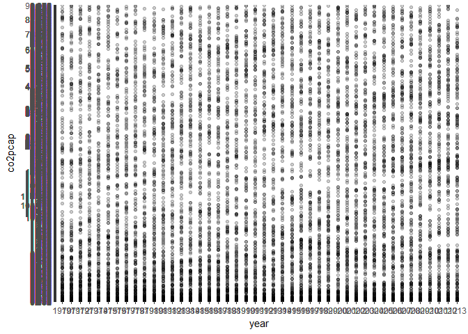
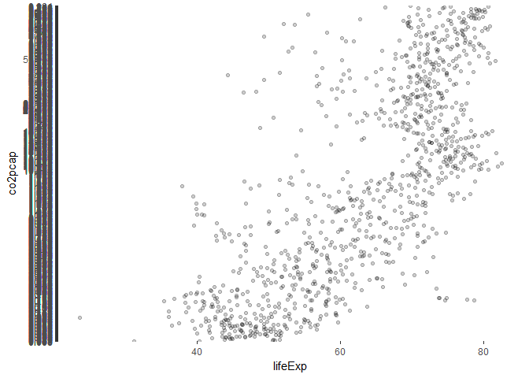

hw04
================
Wynes
October 9, 2017

Part I - Importing and tidying a database
=========================================

For this exercise I want to import a database and then attach it to gapminder. The database is of carbon dioxide per capita emissions from: EDGARv4.2, European Commission, Joint Research Centre (JRC)/PBL Netherlands Environmental Assessment Agency. Emission Database for Global Atmospheric Research (EDGAR), release version 4.2. <http://edgar.jrc.ec.europe.eu>, 2011

So I'm using the read\_csv function from the "readr" package, which is already part of the tidyverse. This will produce a tibble from the csv.

``` r
library("tidyverse")
```

    ## Loading tidyverse: ggplot2
    ## Loading tidyverse: tibble
    ## Loading tidyverse: tidyr
    ## Loading tidyverse: readr
    ## Loading tidyverse: purrr
    ## Loading tidyverse: dplyr

    ## Warning: package 'readr' was built under R version 3.4.2

    ## Conflicts with tidy packages ----------------------------------------------

    ## filter(): dplyr, stats
    ## lag():    dplyr, stats

``` r
library(gapminder)

co2percap <- read_csv("C:/Users/AsusW10/Documents/STAT545/co2pcap.csv")
```

    ## Warning: Missing column names filled in: 'X46' [46], 'X47' [47], 'X48' [48]

    ## Parsed with column specification:
    ## cols(
    ##   .default = col_double(),
    ##   Country = col_character(),
    ##   X46 = col_character(),
    ##   X47 = col_character(),
    ##   X48 = col_character()
    ## )

    ## See spec(...) for full column specifications.

``` r
View(co2percap)
```

Now because the years are listed as columns and the countries are listed as rows I need to rearrange the data.

``` r
co2percap %>% gather(year,co2pcap,-c(Country)) %>% 
  arrange(Country)
```

    ## # A tibble: 9,917 x 3
    ##        Country  year co2pcap
    ##          <chr> <chr>   <chr>
    ##  1 Afghanistan  1970   0.096
    ##  2 Afghanistan  1971   0.104
    ##  3 Afghanistan  1972   0.114
    ##  4 Afghanistan  1973    0.12
    ##  5 Afghanistan  1974   0.162
    ##  6 Afghanistan  1975   0.072
    ##  7 Afghanistan  1976    0.07
    ##  8 Afghanistan  1977   0.113
    ##  9 Afghanistan  1978   0.106
    ## 10 Afghanistan  1979    0.11
    ## # ... with 9,907 more rows

So I've successfully converted a wide data frame into a long data frame and then used the knitr::kable function to display this in a pleasing way.

Let's graph the data to see that it looks reasonable and that nothing has gone amiss.

``` r
ghg <- co2percap %>% gather(year,co2pcap,-c(Country)) %>% 
  arrange(Country) 
ghg %>% 
  filter(!is.na(co2pcap)) %>% 
  ggplot(aes(x=year, y=co2pcap))+
  geom_point(alpha=0.2)
```


There are a lot of NA values, and I tried removing them with na.rm=T, and na.omit but nothing seems to be working. The data seems fine when examining it in a table, but smell testing it with ggplot isn't going to work. I'm going to look at Canadian values for the years where data is available.

``` r
ghg %>% 
  filter(Country=="Canada",year<2014, year>1970) %>% 
  ggplot(aes(x=year, y=co2pcap)) +
  geom_point()+ 
  theme(axis.text.x=element_text(angle=90,hjust=1))
```



These values range within a reasonable space for Canadian per capita emissions.

Part II - Joining with gapminder using dplyr
--------------------------------------------

When I first tried to join these datasets I realized that the column name for country was capitalized in the ghg dataset but not in gapminder, so I used the rename function so that dplyr would recognize the columns as being the same.

``` r
ghg2 <- rename(ghg,country = Country)
View(ghg2)

ghg4 <- ghg2[complete.cases(ghg2), ]
```

So I tried to use this code

left\_join(gapminder, ghg4, by = c("country","year"))

to join the dataframes, but have come up with an error because the year column in the ghg dataframe is not integers. But I found a solution that seems to work on stackoverflow (<https://stackoverflow.com/questions/43126096/change-select-columns-from-character-to-integers>)

``` r
 ghg4 %>% 
  mutate_at(c(2), as.numeric) %>%
left_join(gapminder, ghg4, by = c("country","year"))
```

    ## Warning: Column `country` joining character vector and factor, coercing
    ## into character vector

    ## # A tibble: 9,240 x 7
    ##        country  year co2pcap continent lifeExp      pop gdpPercap
    ##          <chr> <dbl>   <chr>    <fctr>   <dbl>    <int>     <dbl>
    ##  1 Afghanistan  1970   0.096      <NA>      NA       NA        NA
    ##  2 Afghanistan  1971   0.104      <NA>      NA       NA        NA
    ##  3 Afghanistan  1972   0.114      Asia  36.088 13079460  739.9811
    ##  4 Afghanistan  1973    0.12      <NA>      NA       NA        NA
    ##  5 Afghanistan  1974   0.162      <NA>      NA       NA        NA
    ##  6 Afghanistan  1975   0.072      <NA>      NA       NA        NA
    ##  7 Afghanistan  1976    0.07      <NA>      NA       NA        NA
    ##  8 Afghanistan  1977   0.113      Asia  38.438 14880372  786.1134
    ##  9 Afghanistan  1978   0.106      <NA>      NA       NA        NA
    ## 10 Afghanistan  1979    0.11      <NA>      NA       NA        NA
    ## # ... with 9,230 more rows

Because gapminder only has data for ever five years, four out of every five rows are blank for the gapminder data. I can try a left join using the co2 data as my left dataframe

``` r
 ghg4 %>% 
  mutate_at(c(2), as.numeric) %>%
right_join(gapminder, ghg4, by = c("country","year"))
```

    ## Warning: Column `country` joining character vector and factor, coercing
    ## into character vector

    ## # A tibble: 1,704 x 7
    ##        country  year co2pcap continent lifeExp      pop gdpPercap
    ##          <chr> <dbl>   <chr>    <fctr>   <dbl>    <int>     <dbl>
    ##  1 Afghanistan  1952    <NA>      Asia  28.801  8425333  779.4453
    ##  2 Afghanistan  1957    <NA>      Asia  30.332  9240934  820.8530
    ##  3 Afghanistan  1962    <NA>      Asia  31.997 10267083  853.1007
    ##  4 Afghanistan  1967    <NA>      Asia  34.020 11537966  836.1971
    ##  5 Afghanistan  1972   0.114      Asia  36.088 13079460  739.9811
    ##  6 Afghanistan  1977   0.113      Asia  38.438 14880372  786.1134
    ##  7 Afghanistan  1982   0.153      Asia  39.854 12881816  978.0114
    ##  8 Afghanistan  1987    0.19      Asia  40.822 13867957  852.3959
    ##  9 Afghanistan  1992    0.08      Asia  41.674 16317921  649.3414
    ## 10 Afghanistan  1997   0.042      Asia  41.763 22227415  635.3414
    ## # ... with 1,694 more rows

This time I noticed that the co2 data does not go back as far, so there are NA values for 1952, 1957, 1962, and 1967 for the new co2pcap column in this dataframe.

``` r
 ghg4 %>% 
  mutate_at(c(2), as.numeric) %>%
inner_join(gapminder, ghg4, by = c("country","year"))
```

    ## Warning: Column `country` joining character vector and factor, coercing
    ## into character vector

    ## # A tibble: 1,008 x 7
    ##        country  year co2pcap continent lifeExp      pop gdpPercap
    ##          <chr> <dbl>   <chr>    <fctr>   <dbl>    <int>     <dbl>
    ##  1 Afghanistan  1972   0.114      Asia  36.088 13079460  739.9811
    ##  2 Afghanistan  1977   0.113      Asia  38.438 14880372  786.1134
    ##  3 Afghanistan  1982   0.153      Asia  39.854 12881816  978.0114
    ##  4 Afghanistan  1987    0.19      Asia  40.822 13867957  852.3959
    ##  5 Afghanistan  1992    0.08      Asia  41.674 16317921  649.3414
    ##  6 Afghanistan  1997   0.042      Asia  41.763 22227415  635.3414
    ##  7 Afghanistan  2002   0.024      Asia  42.129 25268405  726.7341
    ##  8 Afghanistan  2007   0.021      Asia  43.828 31889923  974.5803
    ##  9     Albania  1972   2.247    Europe  67.690  2263554 3313.4222
    ## 10     Albania  1977   2.248    Europe  68.930  2509048 3533.0039
    ## # ... with 998 more rows

This dataframe only contains rows where I have full information from both datasets. Depending on one's purposes this might be the easiest data to explore. I'm going to perform a quick test with it:

``` r
 ghg_gap <- ghg4 %>% 
  mutate_at(c(2), as.numeric) %>%
inner_join(gapminder, ghg4, by = c("country","year"))
```

    ## Warning: Column `country` joining character vector and factor, coercing
    ## into character vector

``` r
ghg_gap %>% 
  ggplot(aes(x=lifeExp,y=co2pcap), na.rm=TRUE)+
  geom_point(alpha=0.2)
```



So something seems to be wrong with the data but I"m not sure what. I've seen this before with NA values but I don't have any here. I'll try some other joins and see if they experience the same problems.

``` r
 ghg4 %>% 
  mutate_at(c(2), as.numeric) %>%
full_join(gapminder, ghg4, by = c("country","year"))
```

    ## Warning: Column `country` joining character vector and factor, coercing
    ## into character vector

    ## # A tibble: 9,936 x 7
    ##        country  year co2pcap continent lifeExp      pop gdpPercap
    ##          <chr> <dbl>   <chr>    <fctr>   <dbl>    <int>     <dbl>
    ##  1 Afghanistan  1970   0.096      <NA>      NA       NA        NA
    ##  2 Afghanistan  1971   0.104      <NA>      NA       NA        NA
    ##  3 Afghanistan  1972   0.114      Asia  36.088 13079460  739.9811
    ##  4 Afghanistan  1973    0.12      <NA>      NA       NA        NA
    ##  5 Afghanistan  1974   0.162      <NA>      NA       NA        NA
    ##  6 Afghanistan  1975   0.072      <NA>      NA       NA        NA
    ##  7 Afghanistan  1976    0.07      <NA>      NA       NA        NA
    ##  8 Afghanistan  1977   0.113      Asia  38.438 14880372  786.1134
    ##  9 Afghanistan  1978   0.106      <NA>      NA       NA        NA
    ## 10 Afghanistan  1979    0.11      <NA>      NA       NA        NA
    ## # ... with 9,926 more rows

I tried semi\_join and found that it really returned back very little information. full\_join, as seen above, retains all of the data from both dataframes, with the downside that there are now a lot of NA values.

Reflection
==========

So I know I accomplished a lot less than I normally would because I chose a dataframe that wasn't nicely cleaned up already. It took me some time to find out how to convert a csv into a tibble (among many resources, I used this page: <http://readr.tidyverse.org/reference/read_delim.html>).

Additionally, it was very difficult to join the two dataframes. The dataframe on CO2 per capita emissions by different countries has NA values which seems to cause errors when joining them. I managed to use complete.cases to create a version of the database without NA values (in actual research this would not be ideal but I am just trying to learn how to join dataframes). Even then I was still getting error messages for having incompatible types of columns which took more troubleshooting.
