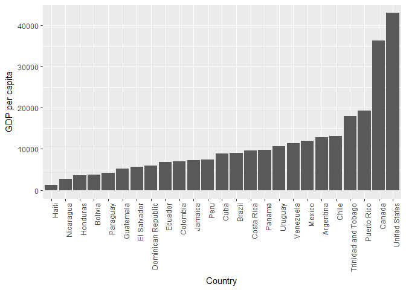
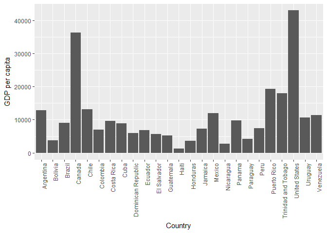
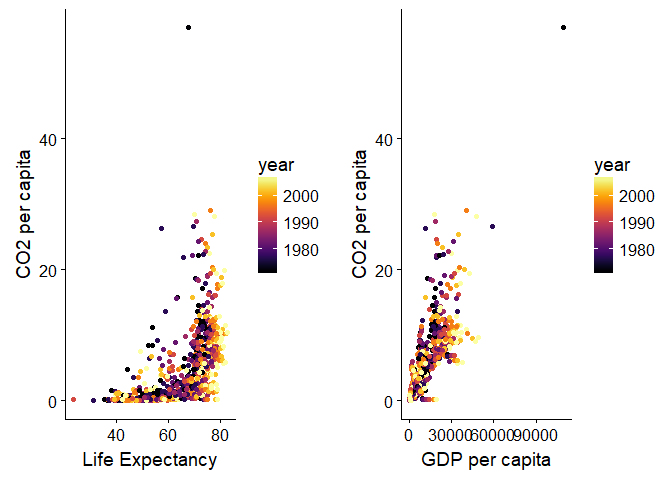

hw05
================
Wynes
October 14, 2017

Homework 5
==========

In this assignment I'm practicing working with factors and inputting and outputting the data.

``` r
suppressPackageStartupMessages(library(tidyverse))
```

    ## Warning: package 'readr' was built under R version 3.4.2

``` r
suppressPackageStartupMessages(library(gapminder))
suppressPackageStartupMessages(library(forcats))
```

    ## Warning: package 'forcats' was built under R version 3.4.2

Dropping factors
----------------

Drop Oceania from the list of continents

``` r
#Filter out Oceania
levels(gapminder$continent)
```

    ## [1] "Africa"   "Americas" "Asia"     "Europe"   "Oceania"

``` r
noo_continents <- c("Asia", "Africa", "Europe", "Americas")
noo_gap <- gapminder %>%
  filter(continent %in% noo_continents)

#Now remove the unwanted Oceania level from the new df h_gap
noo_gap_drop <- noo_gap %>% 
  droplevels()
```

So I've removed the Oceania continent in the new object, noo\_gap, and then in the object noo\_gap\_drop I've gone further and dropped the levels associated with it. We can inspect both of the objects to contrast their properties.

``` r
nlevels(noo_gap$continent)
```

    ## [1] 5

``` r
nlevels(noo_gap_drop$continent)
```

    ## [1] 4

``` r
noo_gap$continent %>% 
levels() 
```

    ## [1] "Africa"   "Americas" "Asia"     "Europe"   "Oceania"

``` r
noo_gap_drop$continent %>% 
  levels()
```

    ## [1] "Africa"   "Americas" "Asia"     "Europe"

``` r
fct_count(noo_gap$continent)
```

    ## # A tibble: 5 x 2
    ##          f     n
    ##     <fctr> <int>
    ## 1   Africa   624
    ## 2 Americas   300
    ## 3     Asia   396
    ## 4   Europe   360
    ## 5  Oceania     0

``` r
fct_count(noo_gap_drop$continent)
```

    ## # A tibble: 4 x 2
    ##          f     n
    ##     <fctr> <int>
    ## 1   Africa   624
    ## 2 Americas   300
    ## 3     Asia   396
    ## 4   Europe   360

From the levels function we see that noo\_gap has one more continent listed as a factor than noo\_gap\_drop and two more countries.

From the fct\_count argument we can see that noo\_gap has the same number of rows for each continent as noo\_gap\_drop except that Oceania is missing completely in noo\_gap\_drop whereas in noo\_gap it is listed as having zero rows.

\*Rearranging Factors

``` r
noo_gap_drop$continent %>% 
  fct_infreq() %>%
  levels() %>% head()
```

    ## [1] "Africa"   "Asia"     "Europe"   "Americas"

Here I've rearranged so that the factor with the largest number of rows (see the fct\_count result above) comes first.

This isn't terribly interesting so let's rearrange countries based on GDP per capita instead.

``` r
fct_reorder(noo_gap_drop$country, noo_gap_drop$gdpPercap) %>% 
  levels() %>% head()
```

    ## [1] "Myanmar"    "Burundi"    "Mozambique" "Eritrea"    "Ethiopia"  
    ## [6] "Cambodia"

``` r
#The default uses median GDP per capita. Here I update to using mean:
fct_reorder(noo_gap_drop$country, noo_gap_drop$gdpPercap, mean) %>% 
  levels() %>% head()
```

    ## [1] "Myanmar"    "Burundi"    "Ethiopia"   "Eritrea"    "Mozambique"
    ## [6] "Malawi"

``` r
#And now use reordering inside ggplot
noo_gap_drop2 <- noo_gap_drop %>% filter(continent == "Americas", year =="2007")
ggplot(noo_gap_drop2, aes(y = gdpPercap, x = fct_reorder(country, gdpPercap))) +
  geom_col() +
  theme(axis.text.x=element_text(angle=90,hjust=1)) +
  labs(x="Country" , y= "GDP per capita")
```



That worked well, let's try and replicate that with the arrange function:

``` r
  noo_gap_drop2 %>% 
  arrange(gdpPercap) %>% 
ggplot(aes(y = gdpPercap, x = country)) +
  geom_col() +
  theme(axis.text.x=element_text(angle=90,hjust=1)) +
  labs(x="Country" , y= "GDP per capita")
```



I conclude that arrange does not carry over into ggplot with piping. I'm going to add the fct\_reorder function back in and see if it is still compatible with the arrange function, but give arrange an opposing command (to arrange by life expectancy instead of GDP per capita).

``` r
  noo_gap_drop2 %>% 
  arrange(lifeExp) %>% 
ggplot(aes(y = gdpPercap, x = fct_reorder(country, gdpPercap))) +
  geom_col() +
  theme(axis.text.x=element_text(angle=90,hjust=1)) +
  labs(x="Country" , y= "GDP per capita")
```


And the figure was clearly ordered by GDP per capita with no regards for the arrange function.

Here I check and see that arrange is still working, and find that it does order the countries correctly by GDP per capita in a table.

``` r
 noo_gap_drop2 %>% 
  arrange(gdpPercap) %>% 
  filter(continent=="Americas") %>% 
  glimpse() %>% 
  knitr::kable()
```

    ## Observations: 25
    ## Variables: 6
    ## $ country   <fctr> Haiti, Nicaragua, Honduras, Bolivia, Paraguay, Guat...
    ## $ continent <fctr> Americas, Americas, Americas, Americas, Americas, A...
    ## $ year      <int> 2007, 2007, 2007, 2007, 2007, 2007, 2007, 2007, 2007...
    ## $ lifeExp   <dbl> 60.916, 72.899, 70.198, 65.554, 71.752, 70.259, 71.8...
    ## $ pop       <int> 8502814, 5675356, 7483763, 9119152, 6667147, 1257292...
    ## $ gdpPercap <dbl> 1201.637, 2749.321, 3548.331, 3822.137, 4172.838, 51...

| country             | continent |  year|  lifeExp|        pop|  gdpPercap|
|:--------------------|:----------|-----:|--------:|----------:|----------:|
| Haiti               | Americas  |  2007|   60.916|    8502814|   1201.637|
| Nicaragua           | Americas  |  2007|   72.899|    5675356|   2749.321|
| Honduras            | Americas  |  2007|   70.198|    7483763|   3548.331|
| Bolivia             | Americas  |  2007|   65.554|    9119152|   3822.137|
| Paraguay            | Americas  |  2007|   71.752|    6667147|   4172.838|
| Guatemala           | Americas  |  2007|   70.259|   12572928|   5186.050|
| El Salvador         | Americas  |  2007|   71.878|    6939688|   5728.354|
| Dominican Republic  | Americas  |  2007|   72.235|    9319622|   6025.375|
| Ecuador             | Americas  |  2007|   74.994|   13755680|   6873.262|
| Colombia            | Americas  |  2007|   72.889|   44227550|   7006.580|
| Jamaica             | Americas  |  2007|   72.567|    2780132|   7320.880|
| Peru                | Americas  |  2007|   71.421|   28674757|   7408.906|
| Cuba                | Americas  |  2007|   78.273|   11416987|   8948.103|
| Brazil              | Americas  |  2007|   72.390|  190010647|   9065.801|
| Costa Rica          | Americas  |  2007|   78.782|    4133884|   9645.061|
| Panama              | Americas  |  2007|   75.537|    3242173|   9809.186|
| Uruguay             | Americas  |  2007|   76.384|    3447496|  10611.463|
| Venezuela           | Americas  |  2007|   73.747|   26084662|  11415.806|
| Mexico              | Americas  |  2007|   76.195|  108700891|  11977.575|
| Argentina           | Americas  |  2007|   75.320|   40301927|  12779.380|
| Chile               | Americas  |  2007|   78.553|   16284741|  13171.639|
| Trinidad and Tobago | Americas  |  2007|   69.819|    1056608|  18008.509|
| Puerto Rico         | Americas  |  2007|   78.746|    3942491|  19328.709|
| Canada              | Americas  |  2007|   80.653|   33390141|  36319.235|
| United States       | Americas  |  2007|   78.242|  301139947|  42951.653|

File I/O
--------

Now that the data has had Oceania removed, levels dropped, filtered to just the Americas and arranged by GDP per capita I'm going to write it to file and then import it back to see what changes have occurred.

``` r
America_GDP <- noo_gap_drop2 %>% 
  arrange(gdpPercap) %>% 
  filter(continent=="Americas")

head(America_GDP) %>% 
  knitr::kable()
```

| country   | continent |  year|  lifeExp|       pop|  gdpPercap|
|:----------|:----------|-----:|--------:|---------:|----------:|
| Haiti     | Americas  |  2007|   60.916|   8502814|   1201.637|
| Nicaragua | Americas  |  2007|   72.899|   5675356|   2749.321|
| Honduras  | Americas  |  2007|   70.198|   7483763|   3548.331|
| Bolivia   | Americas  |  2007|   65.554|   9119152|   3822.137|
| Paraguay  | Americas  |  2007|   71.752|   6667147|   4172.838|
| Guatemala | Americas  |  2007|   70.259|  12572928|   5186.050|

Writing to file:

``` r
write_csv(America_GDP, "America_GDP.csv")
```

At this point I checked and found a csv file in my working directory on my laptop. Now to read the file back in.

``` r
America_GDP2 <- read_csv("America_GDP.csv")
```

    ## Parsed with column specification:
    ## cols(
    ##   country = col_character(),
    ##   continent = col_character(),
    ##   year = col_integer(),
    ##   lifeExp = col_double(),
    ##   pop = col_integer(),
    ##   gdpPercap = col_double()
    ## )

``` r
glimpse(America_GDP2) 
```

    ## Observations: 25
    ## Variables: 6
    ## $ country   <chr> "Haiti", "Nicaragua", "Honduras", "Bolivia", "Paragu...
    ## $ continent <chr> "Americas", "Americas", "Americas", "Americas", "Ame...
    ## $ year      <int> 2007, 2007, 2007, 2007, 2007, 2007, 2007, 2007, 2007...
    ## $ lifeExp   <dbl> 60.916, 72.899, 70.198, 65.554, 71.752, 70.259, 71.8...
    ## $ pop       <int> 8502814, 5675356, 7483763, 9119152, 6667147, 1257292...
    ## $ gdpPercap <dbl> 1201.637, 2749.321, 3548.331, 3822.137, 4172.838, 51...

Recalling the original object (see below) before the input output process, we can see that the order of the countries has been preserved, but in the original object country and continents were factors and in the imported object they are both coded as characters.

``` r
glimpse(America_GDP) 
```

    ## Observations: 25
    ## Variables: 6
    ## $ country   <fctr> Haiti, Nicaragua, Honduras, Bolivia, Paraguay, Guat...
    ## $ continent <fctr> Americas, Americas, Americas, Americas, Americas, A...
    ## $ year      <int> 2007, 2007, 2007, 2007, 2007, 2007, 2007, 2007, 2007...
    ## $ lifeExp   <dbl> 60.916, 72.899, 70.198, 65.554, 71.752, 70.259, 71.8...
    ## $ pop       <int> 8502814, 5675356, 7483763, 9119152, 6667147, 1257292...
    ## $ gdpPercap <dbl> 1201.637, 2749.321, 3548.331, 3822.137, 4172.838, 51...

Visualization design
--------------------

In the last assignment I imported a greenhouse gas database and joined it with gapminder. Here I add that data back into gapminder to have something new to work with.

The rundown of the code in this next chunk is that I'm adding a new dataset, joining it to gapminder and then cleaning it up and calling it gap\_ghg2

``` r
co2percap <- read_csv("C:/Users/AsusW10/Documents/STAT545/co2pcap.csv")
```

    ## Warning: Missing column names filled in: 'X46' [46], 'X47' [47], 'X48' [48]

    ## Parsed with column specification:
    ## cols(
    ##   .default = col_double(),
    ##   Country = col_character(),
    ##   X46 = col_character(),
    ##   X47 = col_character(),
    ##   X48 = col_character()
    ## )

    ## See spec(...) for full column specifications.

``` r
ghg <- co2percap %>% gather(year,co2pcap,-c(Country)) %>% 
  arrange(Country)
ghg2 <- rename(ghg,country = Country)
ghg4 <- ghg2[complete.cases(ghg2), ]

glimpse(ghg4)
```

    ## Observations: 9,240
    ## Variables: 3
    ## $ country <chr> "Afghanistan", "Afghanistan", "Afghanistan", "Afghanis...
    ## $ year    <chr> "1970", "1971", "1972", "1973", "1974", "1975", "1976"...
    ## $ co2pcap <chr> "0.096", "0.104", "0.114", "0.12", "0.162", "0.072", "...

``` r
gap_ghg <-  ghg4 %>% 
  mutate_at(c(2), as.numeric) %>% 
inner_join(gapminder, ghg4, by = c("country","year")) %>% 
  droplevels()
```

    ## Warning: Column `country` joining character vector and factor, coercing
    ## into character vector

``` r
gap_ghg2 <- gap_ghg %>% 
    mutate_at(c(3), as.numeric) 

glimpse(gap_ghg2)
```

    ## Observations: 1,008
    ## Variables: 7
    ## $ country   <chr> "Afghanistan", "Afghanistan", "Afghanistan", "Afghan...
    ## $ year      <dbl> 1972, 1977, 1982, 1987, 1992, 1997, 2002, 2007, 1972...
    ## $ co2pcap   <dbl> 0.114, 0.113, 0.153, 0.190, 0.080, 0.042, 0.024, 0.0...
    ## $ continent <fctr> Asia, Asia, Asia, Asia, Asia, Asia, Asia, Asia, Eur...
    ## $ lifeExp   <dbl> 36.088, 38.438, 39.854, 40.822, 41.674, 41.763, 42.1...
    ## $ pop       <int> 13079460, 14880372, 12881816, 13867957, 16317921, 22...
    ## $ gdpPercap <dbl> 739.9811, 786.1134, 978.0114, 852.3959, 649.3414, 63...

``` r
#Check and see that data looks good
```

Now I'm ready to try and run some visualizations.

``` r
library(cowplot)
```

    ## Warning: package 'cowplot' was built under R version 3.4.2

    ## 
    ## Attaching package: 'cowplot'

    ## The following object is masked from 'package:ggplot2':
    ## 
    ##     ggsave

``` r
library(gridExtra)
```

    ## Warning: package 'gridExtra' was built under R version 3.4.2

    ## 
    ## Attaching package: 'gridExtra'

    ## The following object is masked from 'package:dplyr':
    ## 
    ##     combine

``` r
library(viridis)
```

    ## Warning: package 'viridis' was built under R version 3.4.2

    ## Loading required package: viridisLite

``` r
plot1 <- gap_ghg2 %>% 
  ggplot(aes(x= lifeExp, y=co2pcap)) +
  geom_point(aes(color = year)) +
  scale_colour_viridis(option="inferno") +
  labs(x="Life Expectancy", y="CO2 per capita")

plot2 <- gap_ghg2 %>% 
  ggplot(aes(x= gdpPercap, y=co2pcap)) +
  geom_point(aes(color = year)) +
  scale_colour_viridis(option="inferno") +
   labs(x="GDP per capita", y="CO2 per capita")

grid.arrange(plot1, plot2, nrow=1)
```



``` r
combined_plot <- grid.arrange(plot1, plot2, nrow=1)
```


``` r
save_plot("combined.png", combined_plot, base_aspect_ratio = 1.9)
#save_plot() is the save function for cowplot instead of ggsave() for ggplot
```


So this graph uses a colour scheme from the viridis package, and also makes use of the cowplot package, which changes the default settings in ggplot to something more minimalist. I like how cowplot altered the fonts so that they are a bit more readable than in base ggplot and also how it automatically changed the units, however in my case it made the units on the x-axis for GDP per capita a bit too cramped. I improved this by changing the base aspect ratio to 1.9 when saving the plot. I've also used the gridExtra package to place both graphs side by side.

Below, I replicate an exercise from class on my own dataset.

``` r
#Prepare greenhouse gas data set for use by changing year and co2pcap to numeric

ghg5 <- ghg4 %>% 
  mutate_at(c(2,3), as.numeric)

ghg5 %>% 
  arrange(-co2pcap)
```

    ## # A tibble: 9,240 x 3
    ##       country  year co2pcap
    ##         <chr> <dbl>   <dbl>
    ##  1 Montserrat  2012 118.930
    ##  2 Montserrat  2013 117.827
    ##  3 Montserrat  2003 117.372
    ##  4 Montserrat  2011 117.343
    ##  5 Montserrat  2004 116.135
    ##  6 Montserrat  2002 113.827
    ##  7 Montserrat  2010 113.621
    ##  8 Montserrat  2001 113.083
    ##  9 Montserrat  2009 108.975
    ## 10 Montserrat  2008 103.878
    ## # ... with 9,230 more rows

``` r
colour_layer <- scale_colour_manual("", 
                                    labels=c("Other Countries", "Qatar"),
                                    values=c("black", "red"))

qatar <- ghg5 %>% 
  ggplot(aes(x=year,y=co2pcap)) +
  geom_line(aes(group=country, colour=country=="Qatar", alpha=country=="Qatar")) +
  colour_layer +
  scale_alpha_discrete(range=c(0.2,1), guide=FALSE)+
  labs(x="Year", y="CO2 emissions per capita")

save_plot("qatar.png", qatar, base_aspect_ratio =1.5)
```


Reflect on the process
----------------------

I really enjoyed trying out ways to improve my plotting with ggplot and the various ad ons. I tried to use a devtool package called ggthemr but when cowplot is loaded it seems to override ggthemr so I was not able to use both in the same file. That's the first time that I've experienced packages negatively interacting.

I was dreading having to reorganize my repo but I'm excited to have that resource for the future. I think I may do that with all of my work as I'm frequently coming across problems that I've solved before, but the solution might just be a single line of code for a specific problem. Having an organized area with all of my files and a list of the useful functions or skills used inside of them would be really helpful for this.
